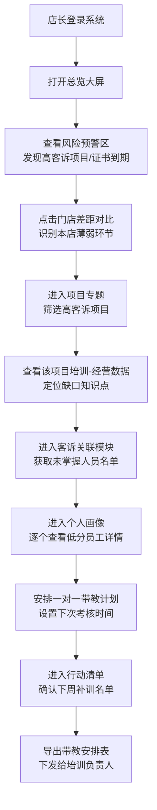
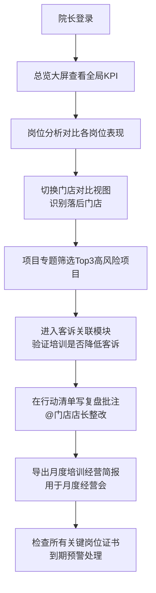

# 医美培训考核驾驶舱 PRD

## 1. 产品概述

医美院长/店长专用的数据驱动培训考核系统，核心价值在于将培训效果与经营结果（成交质量、客诉、复购）直接关联，避免"刷课时"式无效培训。系统通过6大模块透视培训-经营的因果链，让管理者精准定位培训缺口，把时间投入在最影响业绩和合规的环节。

- 目标用户：医美机构院长、门店店长、培训负责人
- 核心价值：培训效果可量化、经营风险可预警、补训行动可落地

---

## 2. 核心功能

### 2.1 用户角色

| 角色 | 登录方式 | 核心权限 |
|------|----------|----------|
| 院长 | 账号登录 | 全模块查看、跨门店对比、写复盘批注、导出简报、全员证书管理 |
| 店长 | 账号登录 | 本店数据查看、个人画像查看、安排一对一带教、生成本店补训名单 |
| 培训负责人 | 账号登录 | 培训数据录入、项目专题维护、考试管理、补训执行跟踪 |

### 2.2 六大功能模块

1. **总览大屏**：经营-培训联动KPI、门店间差距对比、本周风险预警、新项目培训覆盖进度
2. **岗位分析**：咨询师/护士/医生/前台各岗位学习完成率、考试通过率趋势、岗位-经营指标关联
3. **项目专题**：热门医美项目培训覆盖率、考核分与客诉/成交率交叉分析、高风险项目筛选
4. **客诉关联**：客诉类型→对应知识点缺口→培训需求自动映射、Top5高客诉项目培训诊断
5. **个人画像**：员工知识热力图、连续低分知识点、历史考核轨迹、带教安排记录
6. **行动清单**：下周补训名单自动生成、院长复盘批注、证书/授权到期提醒、月度简报导出

### 2.3 页面功能详情

| 页面名称 | 模块名称 | 功能描述 |
|----------|----------|----------|
| 总览大屏 | KPI指标卡 | 显示培训完成率/平均考核分/面诊转化率/客诉率/复购率5大指标，含环比趋势箭头 |
| 总览大屏 | 培训-经营关联图 | 双轴折线图：培训考核均分（左轴）vs 面诊转化率+复购率（右轴），展示时间序列相关性 |
| 总览大屏 | 门店对比柱状图 | 3-5家门店横向对比：学习完成率、考试通过率、客诉率三项综合排名 |
| 总览大屏 | 风险预警卡片 | 红色预警：高客诉项目、连续低分员工、证书到期30天内；黄色预警：培训覆盖率低于70%的新项目 |
| 总览大屏 | 新项目覆盖进度 | 进度条展示3-5个新项目/新设备的培训覆盖进度，显示已完成/未开始/进行中人数 |
| 岗位分析 | 岗位完成率雷达图 | 五维度雷达图对比咨询师/护士/医生/前台/技师的学习完成率、考核通过率、实操达标率等 |
| 岗位分析 | 考试通过率趋势 | 近12周各岗位考试通过率折线图，标注重大培训节点 |
| 岗位分析 | 咨询师-转化关联 | 散点图：X轴=面诊考核分，Y轴=面诊实际转化率，颜色深浅=客单价，识别低转化高考核的"纸上谈兵"员工 |
| 岗位分析 | 护士-回访关联 | 散点图：X轴=操作规范考核分，Y轴=术后回访异常率，识别高风险操作护士 |
| 项目专题 | 项目培训覆盖矩阵 | 项目×岗位矩阵热力图，颜色深浅=覆盖率，一眼识别哪个项目哪个岗位培训不足 |
| 项目专题 | 项目-经营关联表 | 表格列出各项目：培训人次、平均考核分、成交量、客诉率、复购率，支持排序筛选 |
| 项目专题 | 高客诉项目诊断 | 选中某高客诉项目后，展开：客诉分类占比饼图 + 对应未掌握知识点排名 |
| 客诉关联 | 客诉-知识点映射表 | 自动匹配：客诉类型→对应必修课程→未通过人员，列出需补训名单 |
| 客诉关联 | Top5高客诉项目 | 排名卡片，点击可跳转项目专题详情 |
| 客诉关联 | 时间趋势分析 | 客诉量 vs 相关培训完成量的双轴图，验证培训是否降低客诉 |
| 个人画像 | 知识掌握热力图 | 员工各知识点得分的色块矩阵，红色=连续3次低分（重点关注） |
| 个人画像 | 考核轨迹曲线 | 近6个月考核分数趋势线，标注培训/带教节点 |
| 个人画像 | 连续低分知识点列表 | 列出员工3次以上未达标的知识点及对应课程链接 |
| 个人画像 | 一对一带教安排 | 带教老师选择、带教计划、下次考核时间设置、历史带教记录 |
| 行动清单 | 下周补训名单 | 系统自动生成：按岗位/知识点/项目分组的补训推荐，支持勾选确认 |
| 行动清单 | 院长复盘批注 | 富文本批注区，支持@相关人员、附件上传、批注历史记录 |
| 行动清单 | 证书到期提醒 | 列表展示：医师资格证、护士执业证、项目授权证等，30/60/90天内到期用不同颜色标记 |
| 行动清单 | 月度简报导出 | 一键导出PDF/Excel简报，包含本月培训数据汇总、经营关联分析、下月行动计划 |

---

## 3. 核心用户流程

### 店长每周工作流程

### 院长月度复盘流程

---

## 4. 用户界面设计

### 4.1 设计风格：精致医疗商务风

**色彩体系：**
- 主色：深靛蓝 `#1E3A5F` — 专业、信任、医疗属性
- 辅助色1：玫瑰金 `#C9A96E` — 医美行业的精致与高端感
- 辅助色2：柔紫 `#8B7EC8` — 区分女性用户与数据维度
- 警示色：珊瑚红 `#E05A5A`、暖橙 `#F2994A`、嫩绿 `#6FCF97`
- 中性色：极浅灰背景 `#F7F8FA`、卡片白 `#FFFFFF`、正文深灰 `#2C3E50`

**卡片与质感：**
- 圆角半径：12px（大卡片）、8px（小组件）
- 阴影：柔和多层阴影 `0 4px 20px rgba(30, 58, 95, 0.06)`
- 边框：极细1px描边 `rgba(30, 58, 95, 0.08)`
- 悬停：轻微上浮 + 阴影加深 + 玫瑰金底边高亮

**字体体系：**
- 标题字体：Noto Serif SC（思源宋体）— 传递专业精致感
  - 页面大标题：28px / 700weight
  - 模块标题：18px / 600weight
  - 卡片标题：14px / 500weight
- 正文字体：Noto Sans SC（思源黑体）— 数据清晰易读
  - 正文数据：13px / 400weight
  - KPI数字：24-32px / 700weight，使用等宽数字渲染
  - 辅助说明：11px / 400weight，颜色 #8892A0

**布局结构：**
- 左侧固定导航栏（220px宽度）：Logo + 6大模块图标导航
- 顶部状态栏：时间范围选择器、门店筛选器、用户头像
- 主内容区：栅格12列布局，卡片组合形成信息层次
- 全局右侧滑出面板：个人画像详情、批注编辑、导出预览

**图标与动效：**
- 图标风格：线性描边 + 端点圆角，主色填充，关键数据图标加玫瑰金渐变
- 页面加载：卡片从下往上渐入 + 轻微延迟错峰（30ms间隔）
- KPI变化：环比箭头使用脉冲动画（红色下跌/绿色上涨）
- 图表交互：Hover显示数据Tooltip，带平滑淡入淡出
- 风险预警：红色卡片添加呼吸光晕效果

### 4.2 页面设计概览

| 页面名称 | 模块区域 | UI设计要素 |
|----------|----------|------------|
| 总览大屏 | 顶部KPI行 | 5张渐变卡片，每张左侧图标+数据，右下环比小箭头，背景淡色渐变 |
| 总览大屏 | 中部图表区 | 左66%宽放双轴折线图，右34%放门店对比+风险预警（上下布局） |
| 总览大屏 | 底部数据带 | 新项目覆盖进度条组 + 岗位完成率迷你条形图 |
| 岗位分析 | 左主区 | 上半部雷达图+趋势图Tab切换，下半部散点图关联分析 |
| 岗位分析 | 右侧栏 | 岗位筛选器 + 关键岗位人员排名表 |
| 项目专题 | 顶部筛选 | 时间+项目类型+风险等级筛选条 |
| 项目专题 | 核心矩阵 | 项目×岗位热力矩阵，支持行/列排序，悬停显示详情 |
| 项目专题 | 详情抽屉 | 选中项目后右侧滑出：经营数据表+客诉分析+培训建议 |
| 客诉关联 | 左侧映射表 | 客诉类型→知识点→人员三级展开表格 |
| 客诉关联 | 右侧分析区 | Top5排名卡 + 趋势双轴图 |
| 个人画像 | 左侧基本信息 | 员工头像卡+基础数据+岗位标签 |
| 个人画像 | 中部主区 | 知识热力图 + 考核趋势曲线 |
| 个人画像 | 底部操作区 | 连续低分列表 + 带教安排表单 |
| 行动清单 | Tab导航 | 补训名单/复盘批注/证书提醒/简报导出 四个Tab |
| 行动清单 | 列表区 | 表格+多选+批量操作，支持搜索筛选 |
| 行动清单 | 操作面板 | 右侧固定操作栏：批量安排带教、一键导出 |

### 4.3 响应式设计

- **桌面优先**（1440px+）：完整6模块侧边栏，主区多卡片并列
- **笔记本适配**（1280px-1439px）：侧边栏图标折叠为80px，卡片间距微调
- **平板兼容**（768px-1279px）：顶部横向Tab导航替代侧边栏，图表自动缩小
- **移动端**（<768px）：单列滚动布局，卡片堆叠，图表简化为KPI卡片

---

## 5. 数据可视化规范

### 图表类型选择

| 数据场景 | 推荐图表 | 颜色规则 |
|----------|----------|----------|
| KPI指标对比 | 渐变数字卡片 | 达标=绿色渐变、预警=橙色渐变、风险=红色渐变 |
| 时间趋势 | 双轴折线图 | 考核分=靛蓝线、转化率=玫瑰金线、客诉率=珊瑚红线（虚线） |
| 多维度对比 | 分组柱状图 | 门店A/B/C/D使用同一色系不同深浅 |
| 岗位综合能力 | 雷达图 | 各岗位线条+填充色使用主题色区分 |
| 关联分析 | 散点图 | 颜色深浅=客单价、点大小=成交量 |
| 覆盖率矩阵 | 热力图 | 0-60%红→60-80%橙→80-90%黄→90%+绿 |
| 分类占比 | 南丁格尔玫瑰图 | 按客诉数量调整半径，增强视觉冲击力 |

### 交互规范

- 所有图表支持点击下钻（如点击某门店柱状图→自动跳转该门店的门店筛选视图）
- Tooltip内显示：数值+占比+同比环比+排名
- 支持框选时间范围放大查看
