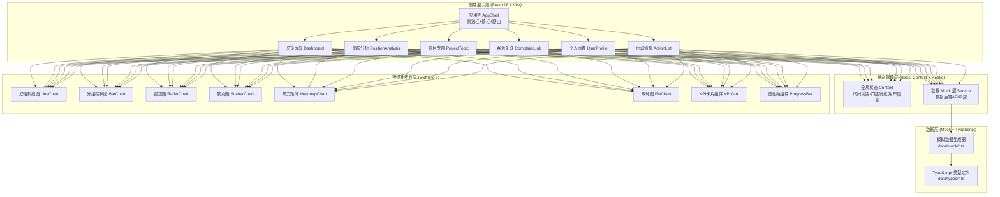
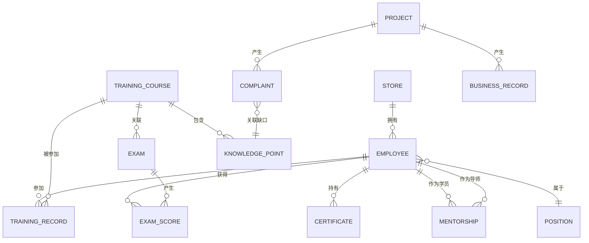

# 医美培训考核驾驶舱 技术架构文档

## 1. 架构总览



---

## 2. 技术选型

### 2.1 核心技术栈

| 层级 | 技术 | 版本 | 选型理由 |
|------|------|------|----------|
| 构建工具 | Vite | ^5.0 | 极速冷启动+HMR，开发体验远超Webpack |
| 框架 | React | ^18.3 | Hooks生态成熟，组件化能力强，社区支持好 |
| 语言 | TypeScript | ^5.4 | 类型安全，大型项目可维护性高 |
| 样式 | Tailwind CSS | ^3.4 | 原子化CSS，快速搭建精致UI，内置响应式 |
| 图表 | ECharts | ^5.5 | 国内最成熟的可视化库，支持热力图/散点/雷达等全类型 |
| 路由 | React Router | ^6.22 | 声明式路由，支持嵌套+动态路由 |
| 图标 | Lucide React | ^0.344 | 线性圆角风格，符合医疗商务调性，Tree-shakable |
| 日期处理 | dayjs | ^1.11 | 轻量（2KB），API友好，替代Moment.js |
| 导出 | xlsx + jspdf | ^0.18 / ^2.5 | 前端导出Excel/PDF简报 |

### 2.2 不引入的服务

- **无后端服务**：全部数据使用前端Mock生成，模拟真实业务场景
- **无状态管理库**：使用React Context + useReducer满足状态需求，避免Redux过度设计
- **无UI组件库**：使用Tailwind原子化自定义组件，保持设计一致性，避免AntD/Element等厚重组件库的AI感

---

## 3. 路由定义

| 路由路径 | 页面组件 | 页面标题 | 说明 |
|----------|----------|----------|------|
| `/` | Dashboard | 总览大屏 | 默认首页，全局KPI+风险预警 |
| `/position` | PositionAnalysis | 岗位分析 | 各岗位数据对比+经营关联 |
| `/project` | ProjectTopic | 项目专题 | 项目培训覆盖矩阵+高客诉诊断 |
| `/complaint` | ComplaintLink | 客诉关联 | 客诉-知识点-人员映射分析 |
| `/profile/:userId` | UserProfile | 个人画像 | 员工知识热力图+带教安排 |
| `/action` | ActionList | 行动清单 | 补训名单+批注+证书+导出 |
| `*` | NotFound | 404 | 路由兜底 |

---

## 4. 目录结构

```
src/
├── assets/                 # 静态资源
│   └── fonts/             # 思源宋体/黑体字体文件
├── components/            # 通用可复用组件
│   ├── layout/
│   │   ├── AppShell.tsx      # 应用壳（侧边栏+顶栏+主区）
│   │   ├── Sidebar.tsx       # 左侧6模块导航
│   │   └── TopBar.tsx        # 顶部筛选栏
│   ├── charts/
│   │   ├── BaseChart.tsx     # ECharts基础封装
│   │   ├── LineChart.tsx     # 双轴折线图
│   │   ├── BarChart.tsx      # 分组柱状图
│   │   ├── RadarChart.tsx    # 雷达图
│   │   ├── ScatterChart.tsx  # 散点关联图
│   │   ├── HeatmapChart.tsx  # 热力矩阵
│   │   └── RosePieChart.tsx  # 南丁格尔玫瑰图
│   ├── common/
│   │   ├── KPICard.tsx       # KPI指标卡片（渐变+环比）
│   │   ├── ProgressBar.tsx   # 覆盖进度条
│   │   ├── WarningCard.tsx   # 风险预警卡片
│   │   ├── StatBadge.tsx     # 状态标签徽章
│   │   └── DataTable.tsx     # 通用数据表格
│   └── business/
│       ├── MentorshipForm.tsx # 一对一带教表单
│       ├── CommentEditor.tsx  # 院长批注编辑器
│       └── ExportPanel.tsx    # 简报导出面板
├── pages/                 # 六大页面模块
│   ├── Dashboard.tsx
│   ├── PositionAnalysis.tsx
│   ├── ProjectTopic.tsx
│   ├── ComplaintLink.tsx
│   ├── UserProfile.tsx
│   └── ActionList.tsx
├── data/                  # 数据层
│   ├── types/             # TypeScript类型定义
│   │   ├── index.ts       # 汇总导出
│   │   ├── common.ts      # 通用类型（门店/岗位/员工）
│   │   ├── training.ts    # 培训/考核/知识点
│   │   ├── business.ts    # 成交/客诉/复购等经营数据
│   │   └── certificate.ts # 证书/授权类型
│   └── mock/              # Mock数据生成器
│       ├── seed.ts        # 随机种子工具函数
│       ├── employees.ts   # 员工档案数据
│       ├── training.ts    # 培训考核数据
│       ├── business.ts    # 经营关联数据
│       ├── projects.ts    # 医美项目数据
│       └── certificates.ts # 证书到期数据
├── context/               # 全局状态
│   └── GlobalContext.tsx  # 时间范围/门店筛选/视图配置
├── hooks/                 # 自定义Hooks
│   ├── useMockData.ts     # 数据请求Hook（延迟模拟网络）
│   └── useChartResize.ts  # 图表自适应Resize
├── utils/                 # 工具函数
│   ├── format.ts          # 数字/百分比/日期格式化
│   ├── color.ts           # 色值映射（分数→颜色/等级→颜色）
│   └── export.ts          # Excel/PDF导出工具
├── styles/
│   ├── index.css          # Tailwind入口+全局样式
│   └── theme.css          # CSS变量主题（色板/字体/圆角）
├── App.tsx                # 路由根组件
└── main.tsx               # 应用入口
```

---

## 5. 核心数据模型

### 5.1 实体关系图 (ER Diagram)



### 5.2 TypeScript 核心类型定义

```typescript
// ============= 基础实体 =============
export interface Store {
  id: string;
  name: string;           // 门店名称：如"北京朝阳店"
  city: string;
  employeeCount: number;
  openingDate: string;
}

export interface Position {
  id: 'consultant' | 'nurse' | 'doctor' | 'reception' | 'technician';
  name: string;           // 咨询师/护士/医生/前台/技师
  color: string;          // 岗位主题色
}

export interface Employee {
  id: string;
  name: string;
  avatar: string;
  positionId: Position['id'];
  storeId: string;
  hireDate: string;
  level: 'S' | 'A' | 'B' | 'C'; // 能力评级
  tags: string[];         // 标签：如"金牌咨询师""高风险"
}

// ============= 培训考核 =============
export interface TrainingCourse {
  id: string;
  name: string;
  category: 'project' | 'regulation' | 'service' | 'sales';
  requiredPositions: Position['id'][];
  knowledgePointIds: string[];
  projectId?: string;     // 关联医美项目（如果是项目培训）
}

export interface KnowledgePoint {
  id: string;
  name: string;           // 知识点名称：如"玻尿酸栓塞识别"
  category: string;
  criticalLevel: 1 | 2 | 3; // 重要程度（3=最高）
  relatedComplaintTypes?: string[]; // 关联客诉类型
}

export interface TrainingRecord {
  id: string;
  employeeId: string;
  courseId: string;
  status: 'not_started' | 'in_progress' | 'completed';
  progress: number;       // 0-100
  lastStudyTime: string;
  completedTime?: string;
}

export interface Exam {
  id: string;
  courseId: string;
  name: string;
  totalScore: number;
  passScore: number;
}

export interface ExamScore {
  id: string;
  employeeId: string;
  examId: string;
  courseId: string;
  knowledgePoints: {      // 各知识点得分
    knowledgePointId: string;
    score: number;
    fullScore: number;
  }[];
  totalScore: number;
  passScore: number;
  passed: boolean;
  examDate: string;
  attemptCount: number;   // 第几次考试
}

// ============= 经营数据 =============
export interface Project {
  id: string;
  name: string;           // 如"热玛吉FLX""玻尿酸填充""眼综合"
  category: '皮肤' | '注射' | '手术' | '仪器';
  price: number;          // 客单价
  trainingCourseIds: string[];
  riskLevel: '低' | '中' | '高';
  isNew: boolean;         // 是否新项目
}

export interface BusinessRecord {
  id: string;
  employeeId: string;     // 关联咨询师/操作医生
  projectId: string;
  storeId: string;
  date: string;
  consultationConverted: boolean;  // 面诊是否转化
  dealAmount: number;
  repurchaseFlag: boolean;        // 是否复购客
  postopAbnormal: boolean;        // 术后回访是否异常
}

export interface Complaint {
  id: string;
  projectId: string;
  storeId: string;
  employeeId: string;     // 关联责任人
  date: string;
  type: string;           // 客诉类型：如"效果不满意""操作不规范""术后红肿"
  severity: '一般' | '严重' | '重大';
  relatedKnowledgeGapIds: string[]; // 关联知识点缺口
  resolved: boolean;
}

// ============= 证书与带教 =============
export interface Certificate {
  id: string;
  employeeId: string;
  type: '医师资格证' | '护士执业证' | '项目授权证' | '设备操作证' | '其他';
  name: string;
  issuer: string;
  issueDate: string;
  expiryDate: string;
  daysToExpiry: number;   // 动态计算
  projectId?: string;     // 关联授权项目
}

export interface Mentorship {
  id: string;
  menteeId: string;       // 学员
  mentorId: string;       # 导师
  knowledgePointIds: string[]; // 带教知识点
  startDate: string;
  nextExamDate: string;
  status: 'scheduled' | 'in_progress' | 'completed' | 'cancelled';
  planNotes: string;
  resultNotes?: string;
}

// ============= 批注 =============
export interface ReviewComment {
  id: string;
  authorId: string;
  authorName: string;
  authorRole: '院长' | '店长' | '培训负责人';
  targetType: 'store' | 'position' | 'project' | 'employee' | 'global';
  targetId?: string;
  content: string;
  mentions: string[];     // @的人员ID
  createdAt: string;
  attachments: { name: string; url: string }[];
}

// ============= 聚合视图模型 =============
export interface DashboardKPI {
  trainingCompletionRate: number;      // 培训完成率
  avgExamScore: number;                // 平均考核分
  consultationConversionRate: number;  // 面诊转化率
  complaintRate: number;               // 客诉率
  repurchaseRate: number;              // 复购率
  momChange: {                         // 环比变化率
    trainingCompletionRate: number;
    avgExamScore: number;
    consultationConversionRate: number;
    complaintRate: number;
    repurchaseRate: number;
  };
}

export interface WarningItem {
  id: string;
  type: 'danger' | 'warning';
  category: 'complaint' | 'employee' | 'certificate' | 'project';
  title: string;
  description: string;
  relatedId: string;
  relatedRoute: string;  // 跳转路由
  priority: number;
}

export interface RemedialListItem {
  id: string;
  employeeId: string;
  employeeName: string;
  position: string;
  storeName: string;
  knowledgePoints: { name: string; examCount: number; avgScore: number }[];
  relatedComplaintType?: string;
  recommendedAction: 'relearn' | 'mentorship' | 'reexam';
  priority: 'high' | 'medium' | 'low';
  selected: boolean;
}
```

---

## 6. 组件架构设计原则

### 6.1 组件层级规范

```
┌──────────────────────────────────────────────────┐
│  Page 页面级组件                                   │
│  ├── 负责组合子模块、处理页面级状态、数据聚合      │
│  └── 不直接写样式，全部通过子组件 + Tailwind组合   │
└──────────────────────────┬───────────────────────┘
                           │
┌──────────────────────────▼───────────────────────┐
│  Business 业务组件                                │
│  ├── 业务语义组件（MentorshipForm/CommentEditor） │
│  └── 接收页面传入的props，封装业务交互逻辑         │
└──────────────────────────┬───────────────────────┘
                           │
┌──────────────────────────▼───────────────────────┐
│  Common 通用组件                                  │
│  ├── KPICard / ProgressBar / WarningCard等       │
│  └── 纯展示 + 基础交互，无业务依赖                 │
└──────────────────────────┬───────────────────────┘
                           │
┌──────────────────────────▼───────────────────────┐
│  Charts 图表组件                                  │
│  ├── BaseChart 封装 ECharts实例生命周期          │
│  └── 传入 option 和 loading状态，统一处理样式     │
└──────────────────────────────────────────────────┘
```

### 6.2 状态管理策略

- **全局Context**（`GlobalContext`）：存储时间范围（本周/本月/近3月）、门店筛选、当前登录用户信息
- **页面级state**：每个Page组件管理自己的筛选条件（如项目专题的风险等级筛选）、展开状态、选中项
- **组件级props**：所有展示组件为受控组件，数据从父级传入，不自行请求
- **Mock数据Hook**：`useMockData(endpoint, params)` 统一封装，内部模拟500ms延迟加载，便于未来替换为真实API

### 6.3 性能优化点

1. **图表懒加载**：页面切换时销毁非活跃页面ECharts实例，释放内存
2. **React.memo**：所有Common组件和Charts组件包装memo，避免无关重渲染
3. **大数据分页**：行动清单表格支持虚拟滚动（使用 `useVirtual` 轻量实现）
4. **CSS变量主题**：色板通过CSS变量定义，避免Tailwind全量生成

---

## 7. 初始化与构建命令

| 命令 | 用途 |
|------|------|
| `npm create vite@latest . -- --template react-ts` | 初始化 Vite + React + TS 项目 |
| `npm install` | 安装基础依赖 |
| `npm install react-router-dom echarts echarts-for-react lucide-react dayjs xlsx jspdf` | 安装业务依赖 |
| `npm install -D tailwindcss@3 postcss autoprefixer` | 安装 Tailwind |
| `npx tailwindcss init -p` | 初始化 Tailwind 配置 |
| `npm run dev` | 启动开发服务器（端口5173） |
| `npm run build` | 构建生产版本 |
| `npm run preview` | 预览构建产物 |
